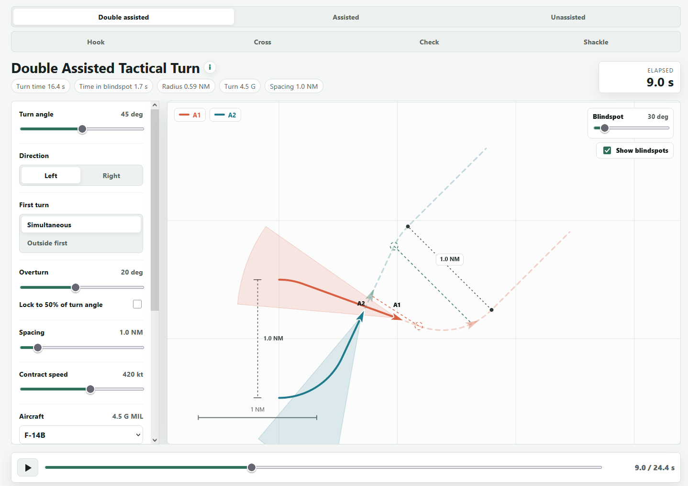

# TAC Turn Illustrator

An interactive single-page tool for visualizing two-ship tactical turns, timing cues, spacing, turn radius, and blindspot exposure.



## Why

Tac turns can be tricky and different doctrines are applied by different airforces / airframes. This is an attempt to show them all in one place so people can be clear about the technique they intend to employ so they can brief accurately and workshop whilst learning tac form maneuvers.

It is also nicely illustrative how contract speed impacts visual cues and the pros and cons of the different turn types.

## Where's the 90?

A 90 is an unassisted turn at 90 degrees. It's in there :)

## Features

- Animated route plots for double assisted, assisted, unassisted, hook, cross, check, and shackle tac form maneuvers.
- Controls for turn direction, turn angle, spacing, speed, sustained turn G, blindspot size, and second-turn timing.
- Level-turn radius calculation based on selected speed and sustained load factor.
- Trigger markers, spacing readouts, elapsed-time scrubber, and optional blindspot cones.

## Usage

Open `index.html` in a browser.

No build step or server is required.

Available here: https://github.com/spanner-uk/Tac-Turn-Illustrator

## Notes

The turn radius model uses the coordinated level-turn equation:

```text
R = V^2 / (g * sqrt(n^2 - 1))
```

where `V` is true speed, `g` is gravitational acceleration, and `n` is the selected sustained load factor. Aircraft presets are practical starting points; exact sustained turn performance varies with altitude, weight, stores, temperature, and engine state.
